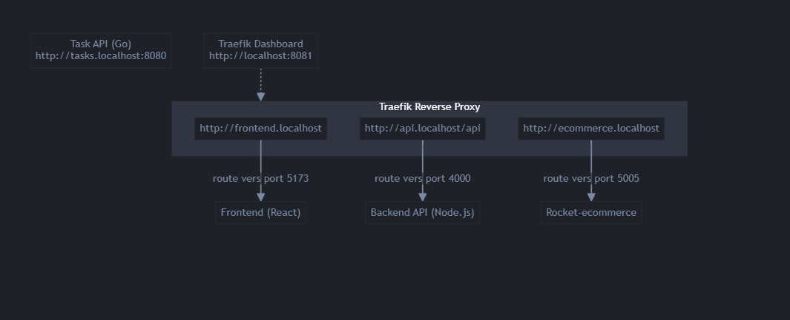

# 🚀 Stack DevSecOps – Déploiement d’Applications avec Traefik & Docker

## Démarche & solutions choisies

Dans le cadre de ce projet, nous avons opté pour une architecture moderne et modulaire, facilitant le développement, la sécurité et la maintenance :

- **Reverse proxy Traefik** : Choisi pour sa simplicité de configuration, sa gestion dynamique des routes via labels Docker, et son dashboard intégré. Il permet d’exposer chaque service sur un sous-domaine local dédié.
- **Découplage des services** : Chaque application (frontend, backend, e-commerce, task-api) est packagée dans un conteneur Docker indépendant, facilitant le déploiement et la scalabilité.
- **Sous-domaines locaux** : Chaque service est accessible via un sous-domaine personnalisé (ex : frontend.localhost, api.localhost, etc.) pour une expérience de développement proche de la production.
- **Task-API hors proxy** : Le microservice task-api est volontairement exposé en dehors de Traefik pour permettre des tests directs, des audits de sécurité ou des accès spécifiques sans passer par le reverse proxy.
- **Sécurité & bonnes pratiques** : Centralisation des variables d’environnement, images Docker optimisées, documentation claire et schéma d’architecture à jour.

L’ensemble de ces choix vise à garantir une stack DevSecOps robuste, évolutive et facilement maintenable.

---

## Sommaire
- Présentation
- Architecture
- Applications déployées
- Technologies & choix
- Lancement rapide
- Accès aux applications
- Publication des images Docker
- Sécurité & bonnes pratiques
- Répartition des tâches
- Contact

---

## Présentation

Ce projet met en place une stack complète de 4 applications pour un client, avec gestion de la sécurité, reverse proxy Traefik, et intégration de la passerelle de paiement Stripe.  
L’ensemble est déployé via un unique fichier `docker-compose.yaml` (Infrastructure as Code), et toutes les images sont publiées sur Docker Hub.

---

## Architecture



---

## Applications déployées

- **Frontend** : Application React (interface utilisateur)
- **Backend** : API Node.js (Express) – intègre Stripe pour les paiements
- **Rocket-ecommerce** : Microservice e-commerce (Node.js)
- **Task-API** : Microservice de gestion de tâches (Go)
- **Traefik** : Reverse proxy moderne, dashboard intégré

---

## Technologies & choix

- **React** : Rapidité de développement, SPA moderne
- **Node.js/Express** : API REST performante
- **Go** : Microservice léger et rapide
- **Traefik** : Reverse proxy dynamique, gestion des routes par labels, dashboard
- **Docker** : Portabilité, reproductibilité, optimisation des images
- **Stripe** : Solution de paiement sécurisée et facile à intégrer

---

## Lancement rapide

```bash
git clone <repo>
cd <repo>
docker-compose up -d
```

---

## Accès aux applications

| Service              | URL d’accès                        |
|----------------------|-------------------------------------|
| Frontend             | http://frontend.localhost           |
| Backend API          | http://api.localhost/api            |
| Rocket-ecommerce     | http://ecommerce.localhost          |
| Task API (Go)        | http://tasks.localhost              |
| Traefik Dashboard    | http://localhost:8081               |

---

## Publication des images Docker

Toutes les images sont disponibles sur Docker Hub :
- `lmessia93/pizzatech-front`
- `lmessia93/pizzatech-back`
- `lmessia93/rocket-ecommerce`
- `lmessia93/task-api`

---

## Sécurité & bonnes pratiques

- **Reverse proxy Traefik** : Toutes les applications sont accessibles via des sous-domaines locaux.
- **Dashboard sécurisé** : Accès au dashboard Traefik sur un port dédié.
- **Images Docker optimisées** : Multi-stage build, taille réduite, bonnes pratiques Docker.
- **Variables d’environnement** : Centralisées et sécurisées dans le docker-compose.
- **Open source** : Code source et images publiés pour la communauté.

---

## Répartition des tâches

| Membre                      | Rôle / Tâches principales                                                                 |
|-----------------------------|------------------------------------------------------------------------------------------|
| **MBARGA Philippe Ivan**    | Lead DevSecOps, coordination du projet, optimisation des images Docker, sécurité globale |
| **Yazi Iles**               | Configuration réseau, documentation                                                      |
| **MESSIA DOLIVEUX Lucas**   | Développement et intégration du backend (API Node.js), intégration de Stripe             |
| **LEROGNON Grégoire**       | Développement du frontend (React), intégration avec l’API                                |
| **NTANTU Japhet**           | Développement du microservice e-commerce, gestion du service task-api, documentation     |

